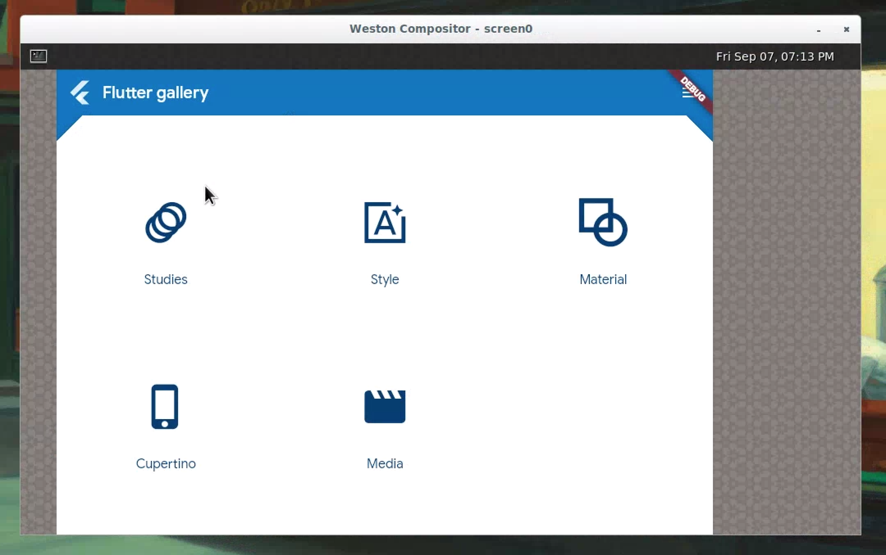

Flutter Wayland
============

A Flutter Embedder that talks to Wayland.



Zodiac Instructions
-------------------

* Make sure `libglfw3-dev` (Ubuntu) or `glfw-wayland` (Arch) package is installed.
* To build with `xdg-shell` protocol extension support (e.g. to support compositors withput `wl_shell` protocol support like KWin):
  * Make sure `wayland-protocols` package is installed (minimum 1.12 version is required).
  * Make sure `extra-cmake-modules` package is installed.
  * Use general `cmake ../ -G Ninja` to build without `xdg-shell` support
  * If you need `xdg-shell` support use `cmake ../ -G Ninja -DWITH_XDG_SHELL=ON` to build with `xdg-shell`

Build Setup Instructions
------------------------

* Install the following packages (on Debian Stretch): `weston`, `libwayland-dev`, `cmake` and `ninja`.
* From the source root `mkdir build` and move into the directory.
* `cmake -G Ninja ../`. This should check you development environment for required packages, download the Flutter engine artifacts and unpack the same in the build directory.
* `ninja` to build the embedder.
* Run the embedder using `./flutter_wayland`. Make sure `weston` is running. See the instructions on running Flutter applications below.

Running Flutter Applications
----------------------------

```
Flutter Wayland Embedder
========================

Usage: `flutter_wayland <asset_bundle_path> <flutter_flags>`

This utility runs an instance of a Flutter application and renders using
Wayland core protocols.

The Flutter tools can be obtained at https://flutter.io/

asset_bundle_path: The Flutter application code needs to be snapshotted using
                   the Flutter tools and the assets packaged in the appropriate
                   location. This can be done for any Flutter application by
                   running `flutter build bundle` while in the directory of a
                   valid Flutter project. This should package all the code and
                   assets in the "build/flutter_assets" directory. Specify this
                   directory as the first argument to this utility.

    flutter_flags: Typically empty. These extra flags are passed directly to the
                   Flutter engine. To see all supported flags, run
                   `flutter_tester --help` using the test binary included in the
                   Flutter tools.

```
